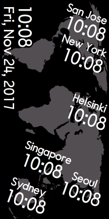

README

This is a watch face I designed for the Samsung Gear Fit2 Pro fitness band using the Samsung [Gear Watch Designer](http://developer.samsung.com/gear/design/watch-designer) application on Mac OS X. It can be tested locally using the [testing instructions](http://developer.samsung.com/gear/design/watch-designer/gear-watch-testing). The `.gwd` and `.tpk` are the actual files used by that application. The rest are ancillary source files.

